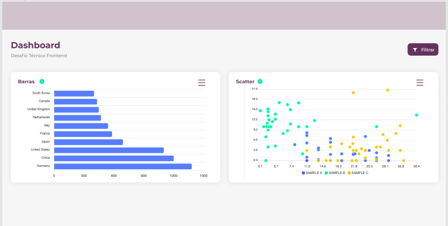

<p align="center">
  <h2 align="center">Dashboard-gráficos</h2>

  <p align="center">
    Página de dashboard com gráficos interativos
  </p>
</p>

<p align="center">
  
</p>

---

<h2>Sobre</h2>
<p align="center">
A aplicação é uma landing page que possui em sua tela principal um título e 2 gráficos, sendo um gráfico de barras simples e um gráfico do tipo Scatter.
</p>

<h3 id="techs">Tecnologias</h3>
  
<div>
  
  
  
  
  
</div>

---

<p>Os gráficos interativos foram produzidos com a biblioteca <a href="https://apexcharts.com/">Apexcharts</a>, e na estilização foi utilizada a biblioteca <a href="https://styled-components.com/">Styled Components</a>.</p>

<h3>Instruções para executar na sua máquina:</h3>

1. Clone o repositório (exemplo SSH) - insira no console:

   ```sh
   git clone git@github.com:felipelouzeiro/dashboard.git
   ```

2. Instale as dependências do projeto:

   ```sh
   cd dashboard/
   npm install
   ```

3. Execute a aplicação:

   ```sh
   npm start
   ```

---

A aplicação está hospedada na plataforma Heroku.

> > [Clique aqui para visualizar a aplicação.](https://dashboard-graphics.herokuapp.com/)
